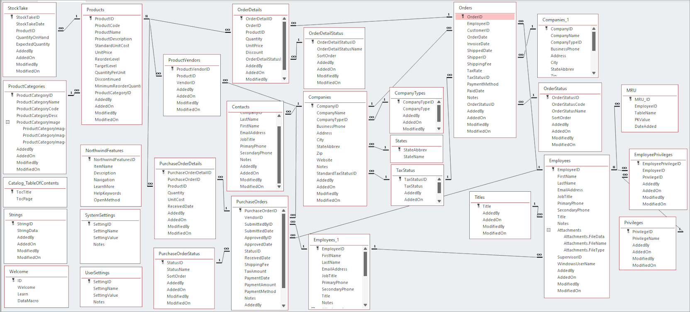

# northwind

northwind study(feat. Spring)

## dependency

### Backend

- Java 17
- gradle
- check `build.gradle` for other dependency

### Frontend

- node v24.14.0
- npm 11.9.0
- check `frontend/package.json` for other dependency

```sh
npm i react-router-dom
npm i styled-reset
npm i styled-components
npm i @types/styled-components -D
npm i axios
```

### Run

```sh
npm run dev
```

### Build

```sh
npm run build
```

## utils

- [swagger open-api](http://127.0.0.1:8080/swagger-ui/index.html)
- [h2 console](http://localhost:8080/h2-console)

## ERD


source: [Northwind database diagram](https://support.microsoft.com/en-us/office/northwind-database-diagram-cd422d47-e4e3-4819-8100-cdae6aaa0857)