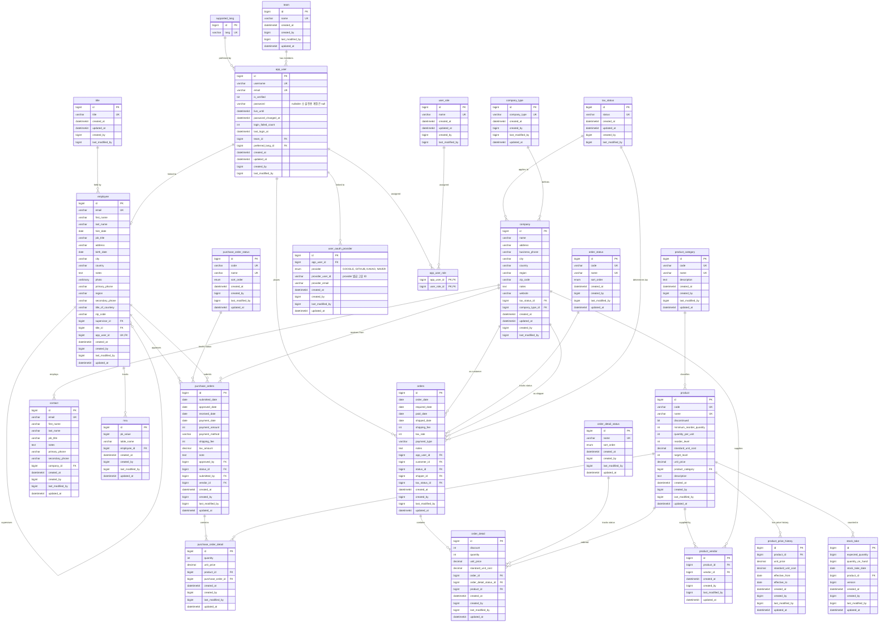

# ERD

```mermaid
erDiagram
company_type {
bigint id PK
varchar company_type UK
datetime64 created_at
bigint created_by
bigint last_modified_by
datetime64 updated_at
}

order_detail_status {
    bigint id PK
    varchar name UK
    enum sort_order
    datetime64 created_at
    bigint created_by
    bigint last_modified_by
    datetime64 updated_at
}

order_status {
    bigint id PK
    varchar code UK
    varchar name UK
    enum sort_order
    datetime64 created_at
    bigint created_by
    bigint last_modified_by
    datetime64 updated_at
}

product_category {
    bigint id PK
    varchar code UK
    varchar name UK
    text description
    datetime64 created_at
    bigint created_by
    bigint last_modified_by
    datetime64 updated_at
}

purchase_order_status {
    bigint id PK
    varchar code UK
    varchar name UK
    enum sort_order
    datetime64 created_at
    bigint created_by
    bigint last_modified_by
    datetime64 updated_at
}

tax_status {
    bigint id PK
    varchar status UK
    datetime64 created_at
    datetime64 updated_at
    bigint created_by
    bigint last_modified_by
}

team {
    bigint id PK
    varchar name UK
    datetime64 created_at
    bigint created_by
    bigint last_modified_by
    datetime64 updated_at
}

title {
    bigint id PK
    varchar title UK
    datetime64 created_at
    datetime64 updated_at
    bigint created_by
    bigint last_modified_by
}

user_role {
    bigint id PK
    varchar name UK
    datetime64 created_at
    datetime64 updated_at
    bigint created_by
    bigint last_modified_by
}

supported_lang {
    bigint id PK
    varchar lang UK
}

app_user {
    bigint id PK
    varchar username UK
    varchar email UK
    bit is_verified
    varchar password "nullable: 소셜 전용 계정은 null"
    datetime64 live_until
    datetime64 password_changed_at
    int login_failed_count
    datetime64 last_login_at
    bigint team_id FK
    bigint preferred_lang_id FK
    datetime64 created_at
    datetime64 updated_at
    bigint created_by
    bigint last_modified_by
}

user_oauth_provider {
    bigint id PK
    bigint app_user_id FK
    enum provider "GOOGLE, GITHUB, KAKAO, NAVER"
    varchar provider_user_id "provider 발급 고유 ID"
    varchar provider_email
    datetime64 created_at
    bigint created_by
    bigint last_modified_by
    datetime64 updated_at
}

app_user_role {
    bigint app_user_id PK, FK
    bigint user_role_id PK, FK
}

company {
    bigint id PK
    varchar name
    varchar address
    varchar business_phone
    varchar city
    varchar country
    varchar region
    varchar zip_code
    text notes
    varchar website
    bigint tax_status_id FK
    bigint company_type_id FK
    datetime64 created_at
    datetime64 updated_at
    bigint created_by
    bigint last_modified_by
}

contact {
    bigint id PK
    varchar email UK
    varchar first_name
    varchar last_name
    varchar job_title
    text notes
    varchar primary_phone
    varchar secondary_phone
    bigint company_id FK
    datetime64 created_at
    bigint created_by
    bigint last_modified_by
    datetime64 updated_at
}

employee {
    bigint id PK
    varchar email UK
    varchar first_name
    varchar last_name
    date hire_date
    varchar job_title
    varchar address
    date birth_date
    varchar city
    varchar country
    text notes
    varbinary photo
    varchar primary_phone
    varchar region
    varchar secondary_phone
    varchar title_of_courtesy
    varchar zip_code
    bigint supervisor_id FK
    bigint title_id FK
    bigint app_user_id UK, FK
    datetime64 created_at
    bigint created_by
    bigint last_modified_by
    datetime64 updated_at
}

mru {
    bigint id PK
    bigint pk_value
    varchar table_name
    bigint employee_id FK
    datetime64 created_at
    bigint created_by
    bigint last_modified_by
    datetime64 updated_at
}

orders {
    bigint id PK
    date order_date
    date required_date
    date paid_date
    date shipped_date
    int shipping_fee
    int tax_rate
    varchar payment_type
    text notes
    bigint app_user_id FK
    bigint customer_id FK
    bigint status_id FK
    bigint shipper_id FK
    bigint tax_status_id FK
    datetime64 created_at
    bigint created_by
    bigint last_modified_by
    datetime64 updated_at
}

product {
    bigint id PK
    varchar code UK
    varchar name UK
    bit discontinued
    int minimum_reorder_quantity
    int quantity_per_unit
    int reorder_level
    decimal standard_unit_cost
    int target_level
    decimal unit_price
    bigint product_category FK
    text description
    datetime64 created_at
    bigint created_by
    bigint last_modified_by
    datetime64 updated_at
}

product_price_history {
    bigint id PK
    bigint product_id FK
    decimal unit_price
    decimal standard_unit_cost
    date effective_from
    date effective_to
    datetime64 created_at
    bigint created_by
    bigint last_modified_by
    datetime64 updated_at
}

product_vendor {
    bigint id PK
    bigint product_id FK
    bigint vendor_id FK
    datetime64 created_at
    bigint created_by
    bigint last_modified_by
    datetime64 updated_at
}

purchase_orders {
    bigint id PK
    date submitted_date
    date approved_date
    date received_date
    date payment_date
    int payment_amount
    varchar payment_method
    int shipping_fee
    decimal tax_amount
    text note
    bigint approved_by FK
    bigint status_id FK
    bigint submitted_by FK
    bigint vendor_id FK
    datetime64 created_at
    bigint created_by
    bigint last_modified_by
    datetime64 updated_at
}

purchase_order_detail {
    bigint id PK
    int quantity
    decimal unit_price
    bigint product_id FK
    bigint purchase_order_id FK
    datetime64 created_at
    bigint created_by
    bigint last_modified_by
    datetime64 updated_at
}

stock_take {
    bigint id PK
    bigint expected_quantity
    bigint quantity_on_hand
    date stock_take_date
    bigint product_id FK
    bigint version
    datetime64 created_at
    bigint created_by
    bigint last_modified_by
    datetime64 updated_at
}

order_detail {
    bigint id PK
    int discount
    int quantity
    decimal unit_price
    decimal standard_unit_cost
    bigint order_id FK
    bigint order_detail_status_id FK
    bigint product_id FK
    datetime64 created_at
    bigint created_by
    bigint last_modified_by
    datetime64 updated_at
}

%% Relationships
supported_lang ||--o{ app_user : "preferred by"
app_user ||--o{ user_oauth_provider : "linked to"
team ||--o{ app_user : "has members"
app_user ||--o{ app_user_role : "assigned"
user_role ||--o{ app_user_role : "assigned"
tax_status ||--o{ company : "applies to"
company_type ||--o{ company : "defines"
company ||--o{ contact : "employs"
employee ||--o{ employee : "supervises"
title ||--o{ employee : "held by"
app_user ||--o| employee : "linked to"
employee ||--o{ mru : "tracks"
app_user ||--o{ orders : "places"
company ||--o{ orders : "as customer"
order_status ||--o{ orders : "tracks status"
company ||--o{ orders : "as shipper"
tax_status ||--o{ orders : "determines tax"
product_category ||--o{ product : "classifies"
product ||--o{ product_price_history : "has price history"
product ||--o{ product_vendor : "supplied by"
company ||--o{ product_vendor : "supplies"
employee ||--o{ purchase_orders : "approves"
purchase_order_status ||--o{ purchase_orders : "tracks status"
employee ||--o{ purchase_orders : "submits"
company ||--o{ purchase_orders : "receives from"
purchase_orders ||--o{ purchase_order_detail : "contains"
product ||--o{ purchase_order_detail : "ordered"
product ||--o{ stock_take : "counted in"
orders ||--o{ order_detail : "contains"
order_detail_status ||--o{ order_detail : "tracks status"
product ||--o{ order_detail : "ordered"
```
